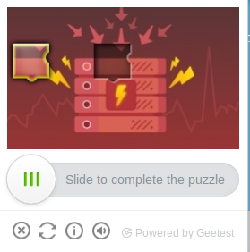

# GEETEST-SLICE-CAPTCHA-SOLVER

Solver for the geetest sliding captcha, implemented with Python and the OpenCV package.

**NOTE:** THIS SOLVER HAS BEEN TESTED ON PRODUCTION CAPTCHAS

## Captcha Explanation

To pass this captcha, the piece need to be moved to his gap.

Here's an example of the captcha:



For this solver, we just need the 2 images that form this captcha (piece and background):


You can find these images in the html of the web page. For example:

```html
<canvas class="geetest_canvas_bg geetest_absolute" height="160" width="260"></canvas>
<canvas class="geetest_canvas_slice geetest_absolute" width="260" height="160"></canvas>
```

### Captcha Solution

The solution of this captcha is the distance between the piece at the beginning and the piece's gap. So if 
the solver matches the gap, it has the solution.

## Solver Dependencies

```
sudo apt-get update -y
sudo apt-get install -y python3-pip python3-dev build-essential libjpeg8-dev zlib1g-dev libglib2.0-0 libsm6 libxext6 libxrender-dev
pip3 install -U pip
pip3 install -r requirements.txt
```

## Example of usage

Open the python console:

```
python3
```

Inside the console:

```python
from solver import PuzleSolver
solver = PuzleSolver("example/piece.png", "example/background.png")
solution = solver.get_position()
solution
```